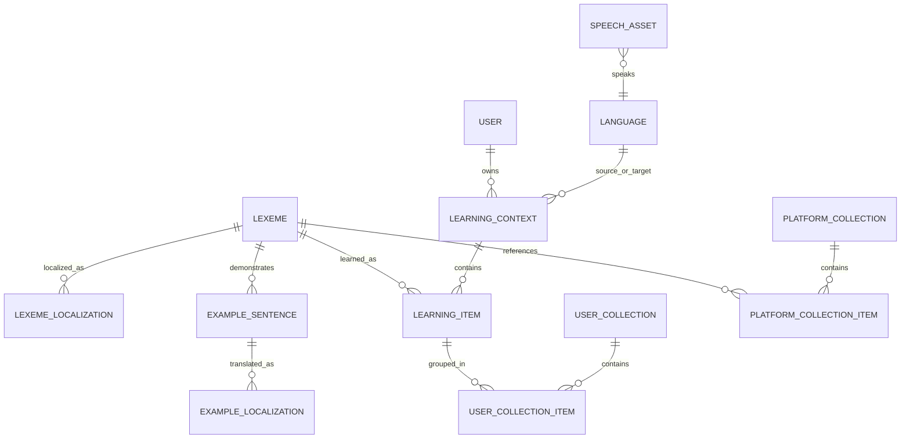

# Multilingual Cards, Shared Vocabulary, Audio, and Collections

Status: proposed implementation specification  
Scope: MVP supports users whose source language is English and learning language is German; the model must next support Arabic and other source languages for German, then arbitrary source/learning language pairs.  
Primary surfaces: Vault, user collections, platform collections, admin collection management, import, review, listen, and word detail.

## 1. Outcome

LinguaCard should treat vocabulary content, translations, audio, a user's learning progress, and collection membership as separate capabilities.

The central rule is:

> A card is a user's learning record for one shared lexical entry in one learning context. It does not own the dictionary definition, translation, audio, category, deck, or collection.

This produces four independent reuse boundaries:

1. A target-language lexical entry is created once application-wide.
2. A localization for that entry is created once per source language application-wide.
3. A synthesized target-language audio asset is created once per exact speech identity application-wide.
4. A user's learning record is created once per user, learning context, and lexical entry, but may belong to multiple collections.

For the MVP, all new records use `sourceLanguage = en` and `targetLanguage = de`. No API or persistence rule may hard-code that pair; defaults may live in one rollout configuration boundary.

## 2. Current-system findings

### 2.1 What is already sound

- `word_dictionary` is global rather than user-owned.
- `word_audio` is global and has a database unique constraint over normalized text and language.
- Platform collections link to dictionary rows through `platform_collection_words` rather than embedding copied word JSON.
- Platform collection adoption is transactional and uses `dictionaryWordId` as its primary duplicate signal.
- Audio and dictionary services deduplicate concurrent work within a single API process.
- Platform collection adoption is idempotent for one user and platform collection.
- Existing target audio is readable by all users, independent of who caused it to be generated.

These capabilities should be evolved, not discarded.

### 2.2 Problems to remove

| Area | Current behavior | Consequence |
|---|---|---|
| Dictionary identity | Unique by `lemmaKey + targetLang + nativeLang` | The same German lexeme is duplicated for English, Arabic, Spanish, and every future source language. |
| Dictionary content | Lexical facts, one translation, native examples, synonyms, category, and audio reference share one row | Language-independent and language-dependent data cannot evolve independently. |
| Card | Owns copied `front/back/article/gender/plural/examples/synonyms/phonetic` JSON | Fixes and translations become stale copies; every adoption creates more duplicated content. |
| Card placement | Card owns `collectionId`, while also owning unused `deckId`, category IDs, and tags | A vocabulary item cannot cleanly appear in multiple collections and the organizational model is ambiguous. |
| Language selection | `de-DE`, `en`, `german-vocab`, and `deck-001` are hard-coded in creation, adoption, playback, and import paths | Adding a language requires changes throughout the stack and can select the wrong translation/audio. |
| Duplicate detection | User-card checks load every card and compare German-specific normalized strings; different import paths use different rules | It is unbounded, user-scoped only, article-sensitive in one path and article-insensitive in another, and can race. |
| Dictionary concurrency | In-memory in-flight maps plus an upsert | Protects only one process; external AI calls may still happen twice across instances before the database conflict is observed. |
| Audio concurrency | In-memory in-flight map plus a unique row | Protects only one process. A stale `pending` row can remain unresolved after a process crash. |
| Audio policy | Shared client service documents HD-only behavior, while comments elsewhere describe browser fallback | Product behavior is unclear and conflicts with the new target/native policy. |
| Audio key | `language + normalizedText` | It cannot distinguish voice, synthesis profile, provider/model change, or word versus sentence rendering. |
| Platform import | JSON words are processed sequentially; collection and links are persisted after external calls without one import job | Large imports are slow, cannot be resumed safely, and expose poor progress/error recovery. |
| Platform collection metadata | Title/emoji/level/topic plus publish flag; no source/target language or thumbnail model | Collections cannot be selected by a user's language pair and artwork behavior is implicit. |
| Admin UX | Import forms and collection management share one large page | Non-technical admins cannot validate JSON, understand reuse/conflicts, edit contents, or see audio readiness before publishing. |
| Categories | Card-level category arrays drive filters and display, while platform collections also have `topic` | Two competing organizational concepts exist. The MVP does not need card categories. |

### 2.3 Fields to retire from cards

- `deckId`: remove. There is no active deck capability distinct from collections.
- `collectionId`: remove after collection membership is represented by a join entity.
- `categoryIds`: remove with category filtering and card-category UI.
- `tags`: remove from the public card contract. The only observed platform provenance tag is replaced by explicit collection/provenance relationships.
- `content.dictionaryWordId`: remove immediately; it duplicates the top-level database column.
- Copied dictionary content in `content`: retire after all read models resolve through shared vocabulary tables.
- `version`: retain only if offline optimistic concurrency actively uses it. Otherwise remove after confirming sync/share migrations do not require it.
- `contextId`: replace with `learningContextId`, a real foreign key. Do not keep magic values such as `german-vocab`.

Category tables and endpoints should be deprecated in the same release that removes category UI. Do not drop them until old clients and stored offline operations can no longer send category fields.

## 3. Domain language

- **Language**: an application-supported BCP-47 language identity, using a canonical base code for content selection (`de`, `en`, `ar`) and an optional locale/voice tag for speech (`de-DE`).
- **Learning context**: the user's selected `sourceLanguage → targetLanguage` pair.
- **Lexeme**: the shared target-language headword and language-specific grammar facts.
- **Localization**: the shared explanation of one lexeme in one source language.
- **Example**: a target-language example sentence belonging to a lexeme.
- **Example localization**: the translation of that example in one source language.
- **Learning item** (public UI name remains “card”): a user's scheduling/progress record for a lexeme in a learning context.
- **Collection**: an ordered grouping. A user collection groups learning items; a platform collection groups lexemes.
- **Speech asset**: reusable synthesized audio for arbitrary target-language text and a specific synthesis profile.

Use `sourceLanguage` and `targetLanguage` everywhere. Do not use `native`, `front`, `back`, or `user language` in new domain/API names because direction becomes unclear when language pairs reverse.

## 4. Proposed persistence model



### 4.1 `languages`

| Field | Notes |
|---|---|
| `code` | PK; canonical base BCP-47 code such as `de`, `en`, `ar`. |
| `displayName` | Admin-facing name. |
| `defaultLocale` | For example `de-DE`, `en-US`, `ar-SA`. |
| `textDirection` | `ltr` or `rtl`. |
| `isSourceEnabled` / `isTargetEnabled` | Feature flags for staged language rollout. |
| `targetSpeechPolicy` | `synthesized` or `device`; initially German is `synthesized`. |
| `sourceSpeechPolicy` | Initially `device`. |

Language configuration is referenced by services; it is not copied into every card.

### 4.2 `learning_contexts`

| Field | Notes |
|---|---|
| `id` | UUID. |
| `userId` | Owner. |
| `sourceLanguage` | FK to languages. |
| `targetLanguage` | FK to languages. |
| `isActive` | One active context per user. |
| timestamps | Auditing. |

Constraint: unique `(userId, sourceLanguage, targetLanguage)` and check `sourceLanguage <> targetLanguage`.

### 4.3 `lexemes`

| Field | Notes |
|---|---|
| `id` | Stable UUID. |
| `language` | Canonical target language. |
| `normalizedLemma` | Language-specific canonical identity. |
| `displayText` | Preferred headword casing. |
| `partOfSpeech` | Extensible language-neutral enum/string. |
| `grammar` | Typed JSON initially; language adapter owns its schema. German includes article, gender, and plurals. |
| `phonetic` | Optional language-specific transcription. |
| `cefrLevel` | Optional. |
| `source`, `model`, timestamps | Provenance and maintenance. |

Constraint: unique `(language, normalizedLemma, partOfSpeech, grammarDiscriminator)`.

`grammarDiscriminator` handles genuine homographs and German noun gender/article identity. It must come from a `LexemeIdentityService`, not ad-hoc string concatenation. Diacritics must not be stripped unless a language adapter explicitly says they are non-distinguishing.

### 4.4 `lexeme_localizations`

| Field | Notes |
|---|---|
| `id` | UUID. |
| `lexemeId` | FK to lexeme. |
| `language` | Source/display language. |
| `translation` | Primary concise translation. |
| `definition` | Optional learner-friendly explanation. |
| `synonyms` | Localized synonym presentation only; structural synonym relationships may later move to a relation table. |
| `status` | `pending`, `ready`, `failed`, `needs_review`. |
| `contentVersion`, `source`, `model`, timestamps | Regeneration and audit metadata. |

Constraint: unique `(lexemeId, language, contentVersion)`. Exactly one version is active. For MVP, `contentVersion = 1`.

This is the translation cache. It is global and never user-owned.

### 4.5 Examples

`example_sentences`: `id`, `lexemeId`, `language`, `normalizedText`, `displayText`, `position`, provenance.  
`example_localizations`: `id`, `exampleSentenceId`, `language`, `text`, status/version/provenance.

Constraints:

- unique `(lexemeId, language, normalizedText)` for the target example;
- unique `(exampleSentenceId, language, contentVersion)` for each translation.

This prevents German example sentences from being regenerated for every source language while allowing their English, Arabic, and future translations to be fetched independently.

### 4.6 `learning_items` (the card persistence entity)

| Field | Notes |
|---|---|
| `id` | UUID. |
| `userId` | Owner. |
| `learningContextId` | Determines source and target languages. |
| `lexemeId` | Shared vocabulary reference. |
| `personalNote` | Optional user-owned content. |
| `customImageUrl` | Optional personal override; otherwise null. |
| timestamps | Auditing. |

Constraint: unique `(userId, learningContextId, lexemeId)`.

Review scheduling remains a separate one-to-one record keyed by learning item ID. A learning item is not duplicated merely because it appears in multiple collections.

### 4.7 Collections

`user_collections`: `id`, `userId`, `learningContextId`, `name`, `description`, `coverSeed`, optional `coverImageUrl`, optional `sourcePlatformCollectionId`, timestamps.  
`user_collection_items`: `collectionId`, `learningItemId`, `position`, timestamps.  
`platform_collections`: `id`, `sourceLanguage`, `targetLanguage`, `title`, `description`, `level`, `topic`, `coverSeed`, optional `coverImageUrl`, `status`, `publishedAt`, timestamps.  
`platform_collection_items`: `platformCollectionId`, `lexemeId`, `position`, timestamps.

Constraints:

- unique `(collectionId, learningItemId)`;
- unique `(platformCollectionId, lexemeId)`;
- unique `(userId, sourcePlatformCollectionId)` where the source is not null;
- platform collection item language must equal the platform collection target language, enforced by the application and an integrity check/migration test.

Counts (`cardCount`, `masteredCount`, `dueCount`, `wordCount`) are read-model values, not authoritative writable columns. Initially calculate them in bounded aggregate queries; add projections only after measurement shows a need.

### 4.8 `speech_assets`

| Field | Notes |
|---|---|
| `id` | UUID. |
| `language` | Canonical spoken language/locale. |
| `normalizedText` | From the language-specific speech normalizer. |
| `displayText` | Original text used for generation. |
| `voiceKey` | Stable internal voice selection, not a raw provider name. |
| `profileVersion` | Changes when SSML/rate/style policy changes. |
| `contentKind` | `word`, `example`, or `sentence`; included only when it changes synthesis. |
| `status` | `pending`, `generating`, `ready`, `failed`. |
| `leaseOwner`, `leaseExpiresAt`, `attemptCount`, `nextRetryAt` | Cross-process job ownership and recovery. |
| storage URL/path, MIME, duration, checksum | Asset metadata. |

Constraint: unique `(language, normalizedText, voiceKey, profileVersion, contentKind)`.

If `contentKind` does not affect generated bytes, remove it from both the identity and API. Never add identity fields that do not change output.

Source-language pronunciation is not stored in `speech_assets` for the initial product policy. It is spoken by a `DeviceSpeechService` using Web Speech in PWA and the native Capacitor/iOS/Android speech API on devices. Target-language text uses `SpeechAssetService`. Callers choose by semantic role (`target` or `source`), not by hard-coded German/English checks.

## 5. Required service boundaries

### 5.1 `LexemeIdentityService`

- Selects a normalizer by language.
- Produces a typed lexeme identity from text, part of speech, and relevant grammar.
- Owns German article-prefix parsing during legacy migration only.
- Has pure unit tests for casing, whitespace, punctuation, umlauts, `ß`, article handling, homographs, Arabic normalization when introduced, and Spanish accents when introduced.

No controller, import service, or UI implements its own word normalization.

### 5.2 `LexemeRegistryService`

- `findOrCreateLexeme(input)` resolves a global lexeme through a database uniqueness constraint.
- It never calls translation or speech providers.
- On conflict, it reads and returns the winner.
- It returns `{ lexeme, outcome: reused | created }`.

### 5.3 `LocalizationService`

- `resolveLocalization(lexemeId, sourceLanguage, options)` reads the global localization first.
- Missing content is claimed through a database-backed job/lease before any AI call.
- Concurrent callers receive the ready localization, a stable pending result, or join/poll the same job; they never each invoke AI.
- It separately resolves example localizations so an already translated example is not regenerated.
- Admin JSON may supply reviewed localization content and bypass AI, but it still passes schema validation and the same uniqueness constraints.

### 5.4 `SpeechAssetService`

- Accepts arbitrary text plus a resolved speech profile.
- Cache lookup, claim, generation, storage, retry, and result mapping live here.
- Uses a database lease or queue with atomic claim semantics; the in-memory promise map remains an optimization only.
- A worker that finds expired `generating` leases retries safely and first checks deterministic storage for an existing object.
- Upload uses a deterministic path derived from the full speech identity and checksum.
- Provider adapters remain replaceable infrastructure.

### 5.5 `PronunciationService` on the client

Public methods express intent:

- `playTarget(text, targetLanguage, options)` → shared synthesized asset.
- `playSource(text, sourceLanguage, options)` → device/browser speech.
- `preloadTarget(items)` → shared synthesized asset resolution and local device cache.
- `stop()`.

The current `WordAudioService` should be renamed/refactored because it also handles examples and sentences. UI components must not decide provider, subscription, or platform behavior.

Platform collections always seed target speech assets before publication. User-created content may follow subscription/cost policy, but any globally ready asset remains reusable by everyone.

### 5.6 `LearningItemService`

- `findOrCreateForUser(userId, learningContextId, lexemeId)` is idempotent under the database unique constraint.
- It creates scheduling only when it creates the learning item.
- It never copies dictionary/localization content.
- It returns an explicit outcome so import/adoption can report created versus reused.

### 5.7 `CollectionService`

- Owns user collection metadata and ordered membership only.
- `addLearningItem` is idempotent through the membership constraint.
- Removing a learning item from a collection does not delete the learning item or its review history.
- Deleting a collection deletes memberships; orphaned learning items remain in the Vault's “All words” set unless the user explicitly deletes the word from their Vault.

### 5.8 `PlatformCollectionImportService`

Admin import is a durable use case, not a controller loop:

1. validate the document without side effects;
2. normalize and deduplicate within the document;
3. report existing lexemes/localizations/assets and conflicts;
4. on confirmation, create an import job;
5. resolve/create lexemes in bounded batches;
6. persist supplied localizations or resolve missing ones;
7. create platform collection membership transactionally;
8. enqueue target audio for headwords and target examples;
9. mark readiness; and
10. allow publication only when required content is ready.

The job has `draft`, `validating`, `ready_to_import`, `importing`, `needs_attention`, `ready_to_publish`, `published`, and `failed` states. Retrying resumes by stable item identity.

## 6. Duplicate guarantees

“Never generated twice” must mean “at-most-one committed reusable result and no avoidable duplicate provider call under normal concurrency.” Absolute exactly-once execution cannot be guaranteed across a remote provider timeout; the system minimizes that edge case with deterministic identity, database claims, storage checks, and idempotent retries.

| Resource | Identity | Enforcement |
|---|---|---|
| Lexeme | language + normalized lemma + POS + grammar discriminator | DB unique constraint; conflict-read. |
| Localization | lexeme + source language + content version | DB unique constraint and generation lease. |
| Example | lexeme + target language + normalized sentence | DB unique constraint. |
| Example localization | example + source language + content version | DB unique constraint and generation lease. |
| Speech asset | language + normalized text + voice + profile version (+ meaningful kind) | DB unique constraint, atomic lease, deterministic storage path. |
| User learning item | user + learning context + lexeme | DB unique constraint. |
| User collection membership | collection + learning item | Composite PK/unique constraint. |
| Platform membership | platform collection + lexeme | Composite PK/unique constraint. |

Do not use a preflight “check duplicates, then insert” as the correctness mechanism. Preflight is for UX; constraints and idempotent commands provide correctness.

## 7. API contracts

All language inputs use canonical codes and are validated against enabled languages. IDs are UUIDs. Responses are explicit read models, never ORM entities.

### 7.1 Vocabulary

- `POST /v2/lexemes/resolve`
  - input: `{ targetLanguage, text, partOfSpeech?, grammar? }`
  - output: `{ lexeme, outcome }`
- `POST /v2/localizations/resolve`
  - input: `{ lexemeId, sourceLanguage }`
  - output discriminated as `ready`, `pending`, or `failed`.
- `POST /v2/learning-items`
  - input: `{ learningContextId, lexemeId, collectionIds?: string[], personalNote? }`
  - output: `{ item, itemOutcome, membershipsAdded }`.
- `GET /v2/learning-items?learningContextId=&collectionId=&query=&cursor=&limit=`
  - returns the joined card read model for the requested language pair.

`CardView`:

```ts
interface CardView {
  id: string;
  learningContextId: string;
  sourceLanguage: string;
  targetLanguage: string;
  lexeme: {
    id: string;
    text: string;
    partOfSpeech: string;
    grammar: Record<string, unknown>;
    phonetic: string | null;
  };
  localization: {
    language: string;
    translation: string;
    definition: string | null;
  };
  examples: Array<{
    id: string;
    targetText: string;
    sourceText: string | null;
  }>;
  personalNote: string;
  reviewState: ReviewSchedulingState;
  collectionIds: string[];
  createdAt: string;
  updatedAt: string;
}
```

The API may flatten this for rendering only if field names remain directional and the shared contract is not reused as a persistence model.

### 7.2 Collections

- `GET /v2/vault?learningContextId=` returns lightweight summary blocks for All Words, My Collections, and Platform Collections.
- `GET/POST/PATCH/DELETE /v2/collections` manage metadata.
- `PUT /v2/collections/:id/items/:learningItemId` idempotently adds membership.
- `DELETE /v2/collections/:id/items/:learningItemId` removes membership only.
- `PATCH /v2/collections/:id/items/order` applies an ordered list with optimistic version.
- `GET /v2/platform-collections?sourceLanguage=&targetLanguage=&level=&query=&cursor=`.
- `GET /v2/platform-collections/:id?sourceLanguage=` resolves the correct localization.
- `POST /v2/platform-collections/:id/adopt` uses the caller's active learning context and is idempotent.

Adoption returns counts for `learningItemsCreated`, `learningItemsReused`, `membershipsAdded`, `membershipsAlreadyPresent`, and `localizationsPending`. “Skipped” alone is too ambiguous.

### 7.3 Speech

- `POST /v2/speech-assets/resolve` accepts `{ role: 'target', language, text, contentKind }`.
- Native/source speech never calls this endpoint under the initial policy.
- Batch resolve preserves input order and returns one result per input, including failures. The current implementation appends ready results before generated results and therefore does not guarantee input order.
- Admin readiness endpoint reports required, ready, generating, and failed assets for a collection.

### 7.4 Admin platform collections

- `POST /v2/admin/platform-collection-imports/validate` performs read-only validation and reuse analysis.
- `POST /v2/admin/platform-collection-imports` starts a durable import from the validated payload/fingerprint.
- `GET /v2/admin/platform-collection-imports/:id` returns per-stage progress and row errors.
- `GET /v2/admin/platform-collections` lists drafts and published collections.
- `GET/PATCH/DELETE /v2/admin/platform-collections/:id` supports metadata and draft removal.
- `PUT/DELETE/PATCH .../:id/items` supports add, remove, and reorder.
- `POST .../:id/prepare-audio` resolves missing target assets.
- `POST .../:id/publish` performs readiness checks and publishes atomically.
- `POST .../:id/unpublish` removes discovery visibility without deleting user-adopted collections or shared vocabulary/audio.

Delete is allowed only for a draft with no external references. Otherwise use archive. Shared lexemes, localizations, and speech assets are never cascade-deleted with a platform collection.

## 8. Platform collection JSON v2

```json
{
  "schemaVersion": 2,
  "collection": {
    "externalId": "a1-travel-basics",
    "title": "Travel Basics",
    "description": "Essential German for stations, hotels, and directions.",
    "sourceLanguage": "en",
    "targetLanguage": "de",
    "level": "A1",
    "topic": "travel",
    "cover": { "mode": "derived" }
  },
  "items": [
    {
      "position": 1,
      "lexeme": {
        "text": "Bahnhof",
        "partOfSpeech": "noun",
        "grammar": { "article": "der", "gender": "masculine", "plurals": ["Bahnhöfe"] },
        "phonetic": null,
        "cefrLevel": "A1"
      },
      "localization": {
        "language": "en",
        "translation": "train station",
        "definition": "a place where trains stop for passengers"
      },
      "examples": [
        { "targetText": "Wo ist der Bahnhof?", "sourceText": "Where is the train station?" }
      ]
    }
  ]
}
```

Validation rules:

- reject unknown schema versions;
- reject source and target equality;
- reject unsupported language pairs;
- require unique positions and unique lexeme identities within the file;
- validate grammar through the target-language adapter;
- require each localization language to match collection source language;
- limit title/description/item counts and text sizes;
- report JSON pointer, row number, severity, and remediation;
- calculate a canonical payload fingerprint to make import retries idempotent;
- classify rows as `new`, `lexeme_reused`, `localization_reused`, `content_conflict`, or `invalid`;
- never silently overwrite reviewed global content. A conflict requires choosing existing content or creating a reviewed new content version.

## 9. Screen and interaction specification

### 9.1 Vault becomes the collection home

One Vault route owns vocabulary and collections. Remove the current category-filter concept.

Top area:

- learning-pair selector in app chrome (`English → German` for MVP; hide it while only one pair is enabled);
- title “Vault”;
- search across target word, source translation, and collection name;
- primary add action opening `Add word`, `Create collection`, `Import words`.

Content order:

1. **All words** summary card with total, due, and mastered counts.
2. **My collections** horizontal or two-column responsive grid with cover thumbnails, title, word count, due count, and progress.
3. **Explore collections** platform shelf filtered to the active language pair, with “See all”.

Do not show per-card categories or category chips. Level and topic belong to platform collection discovery metadata; they are not card organization.

States:

- initial skeleton preserving cover-card geometry;
- offline cached content with a subtle offline notice;
- no words and no collections: one guided empty state with “Add your first word” and “Browse starter collections”;
- collections but no words: keep collections visible and show zero progress;
- per-section failure with retry; do not blank the whole Vault.

### 9.2 Collection thumbnail system

Every collection has a thumbnail derived from its normalized name:

1. hash `lowercase(trim(collapseWhitespace(name)))` with a stable published algorithm;
2. select one of a fixed accessible gradient palettes;
3. select one abstract shape composition;
4. render the first meaningful grapheme or admin-selected emoji as the focal mark;
5. ensure title remains text outside the image for accessibility.

Store `coverSeed` at creation so renaming does not unexpectedly change existing artwork. For imported platform collections, default the seed from `externalId` when present, otherwise title. `coverImageUrl` is an optional later override; it must not be required for MVP. The same shared `CollectionCoverComponent` renders Vault cards, detail heroes, admin preview, and onboarding.

This satisfies “derived from collection name” without image-generation cost, network dependency, or duplicated bitmap storage. Admin can use “Regenerate from current name” to intentionally update the seed.

### 9.3 User collection detail

- Derived thumbnail hero, collection name, optional description, and overflow menu.
- Stats: words, due, mastered percentage.
- Primary actions: Review and Listen.
- Search field for this collection.
- Ordered word rows showing target headword, source translation, target audio button, and progress state.
- Add words action opens a sheet supporting existing-Vault search first, then new word creation.
- Overflow: edit details, reorder words, remove collection, delete collection.

Removing a row offers “Remove from this collection”; deleting the vocabulary item is a separate destructive action in word detail. Do not expose category filters.

### 9.4 Platform collection discovery and detail

Discovery lives inside Vault and uses active `sourceLanguage → targetLanguage` automatically. Level/topic filters are discovery filters, not card categories. Each cover shows thumbnail, title, level, word count, and known count.

Detail shows:

- thumbnail hero and language pair;
- title, description, level/topic;
- counts for new and already-in-Vault words;
- localized word rows;
- target-language synthesized playback only;
- adoption CTA with exact outcome language;
- optional related stories.

When a localization is pending, show the target word and “Translation preparing” rather than substituting another source language.

### 9.5 Add word

Flow:

1. target headword input under the active language pair;
2. debounced read-only lexeme/localization lookup;
3. show `Already in your Vault`, `Shared word found`, or `New word`;
4. show resolved translation and grammar for confirmation;
5. choose zero or more collections;
6. create/reuse the learning item and add memberships atomically.

Remove deck, category, and manual target pronunciation controls. Allow personal notes. The UI must not claim success until the idempotent server command returns or a typed offline command is safely queued.

### 9.6 Admin collections

Replace the combined import/manage page with a small admin collection feature:

- **Collections list**: thumbnail, title, language pair, level, item count, localization readiness, audio readiness, status, updated date; filters for status and language pair.
- **New import**: drag/drop or paste JSON, validate, then preview.
- **Import preview**: metadata/cover preview, totals for new/reused/conflict/invalid, expandable row issues, and explicit Import button.
- **Import progress**: durable stages and counts; safe to leave and return.
- **Collection editor**: edit metadata, regenerate cover, add/remove/reorder vocabulary, inspect localization/audio state, retry failed assets.
- **Publish review**: checklist for required metadata, zero invalid/conflict rows, all required source localizations ready, all target headword audio ready, and optional example-audio policy. Publish is disabled until mandatory checks pass.

Admin actions use intent-oriented labels: Validate, Import draft, Prepare audio, Preview as learner, Publish, Unpublish, Archive. A non-technical admin never sees dictionary IDs unless expanding technical details.

### 9.7 RTL and accessibility

- Direction is taken from language configuration and applied to localized content spans, not blindly to the whole application shell.
- Arabic translations use `dir="rtl"`; German headwords remain `dir="ltr"`.
- Cover focal marks are decorative; collection name is the accessible label.
- Audio controls expose loading, playing, unavailable, and retry states.
- Every drag reorder has keyboard move-up/move-down equivalents.
- Color is not the only indication of import or audio readiness.

## 10. Angular architecture

Suggested feature boundaries:

```text
vault/
  pages/vault-page                  container
  pages/collection-detail-page      container
  pages/platform-collection-page    container
  components/collection-cover
  components/collection-tile
  components/collection-word-list
  components/add-word-sheet
  state/vault.store.ts              route/feature scoped where practical
  data-access/vault-api.service.ts
  data-access/collection-api.service.ts

admin/platform-collections/
  pages/collection-list-page
  pages/import-page
  pages/import-preview-page
  pages/collection-editor-page
  state/admin-platform-collections.store.ts
  data-access/admin-platform-collections-api.service.ts

shared/pronunciation/
  pronunciation.service.ts
  speech-asset-api.service.ts
  device-speech.service.ts
  speech-device-cache.service.ts
```

- Containers connect routes, Signal Stores, and navigation.
- Presentational collection/word/cover components use signal inputs and outputs and `OnPush`.
- Signal Stores own request state and intent methods such as `loadVault`, `adoptPlatformCollection`, `validateImport`, `publishCollection`.
- Read models are canonical server state; counts, filtered lists, and progress percentages are computed.
- Use `switchMap` for route/search reads, `exhaustMap` for import/publish button commands, and `concatMap` for ordered membership writes. Do not use `switchMap` for mutations that must finish.
- Store request states as discriminated unions. Reset detail state when route ID or learning context changes.
- Native speech is an infrastructure side effect behind `DeviceSpeechService`; components do not call browser or Capacitor APIs directly.
- Replace root-global collection detail caches with route-scoped state or key every request/result by learning context plus entity ID.

## 11. NestJS architecture

Suggested modules:

- `languages`: configuration and language adapters;
- `vocabulary`: lexeme identity/registry and repositories;
- `localizations`: localization generation and provider adapter;
- `speech-assets`: asset registry, worker, storage, and TTS adapters;
- `learning-items`: user vocabulary and scheduling coordination;
- `collections`: user collection membership;
- `platform-collections`: discovery/adoption;
- `admin-platform-collections`: validation, import jobs, editing, readiness, and publication.

Controllers validate transport input and delegate. Application services own workflows. Repositories own non-trivial queries. Provider/storage models do not leak into domain responses.

Transactions:

- learning-item create + initial scheduling + requested memberships;
- platform collection metadata + ordered membership commit;
- platform adoption's user collection + learning item/membership inserts;
- publish status transition after a consistent readiness check.

Do not keep a transaction open during AI/TTS calls. Persist/claim work, commit, process externally, then persist results.

## 12. Migration plan

### Phase 0 — Measure and freeze assumptions

- Inventory distinct `contextId`, `deckId`, category, tag, and language values.
- Count duplicate dictionary rows grouped by target-language lexeme across native languages.
- Count cards with null/mismatched `dictionaryWordId`, cards in multiple logical sources, stale pending audio, and platform collections with duplicate word links.
- Add metrics for lexeme hit, localization hit, audio hit, generation attempts, conflicts, stale leases, and import duration.

### Phase 1 — Introduce new shared registries

- Create languages, lexemes, localizations, examples, example localizations, and speech asset schema.
- Backfill lexemes from `word_dictionary`, merging rows that differ only by native language.
- Backfill one localization per old dictionary row.
- Backfill examples and their translations.
- Migrate word audio to the new full identity using the current voice/profile as version 1.
- Keep compatibility reads; no client change yet.

### Phase 2 — Simplify learning items and memberships

- Create learning contexts and map `german-vocab` to `en → de`.
- Add `lexemeId` and `learningContextId` to cards/learning items.
- Create user collection membership rows from `cards.collectionId`.
- Map platform collection words to lexemes.
- Add constraints only after reconciliation reports zero unresolved records.

### Phase 3 — V2 APIs and client read models

- Ship new vocabulary, collection, platform, and pronunciation contracts behind flags.
- Update Vault, collection detail, review, listen, word detail, story vocabulary, import, sharing/sync, and offline storage consumers.
- Version local device storage and migrate or invalidate cached old card shapes intentionally.
- Remove category display/filter/add controls.

### Phase 4 — Admin workflow and publication gates

- Ship JSON v2 validation/import jobs and collection editor.
- Re-import or migrate current platform collections.
- Prepare target headword audio and verify readiness.
- Route non-technical management through the new screens.

### Phase 5 — Remove legacy fields

- Stop accepting deck/category/tag/copied content in DTOs.
- Remove compatibility mappers, legacy endpoints, category UI/services, `deckId`, `collectionId`, `categoryIds`, `tags`, duplicate content JSON, and duplicate dictionary audio references.
- Drop old tables/columns only after one stable release and verified rollback backup.

### Phase 6 — Enable Arabic-source German

- Enable `ar` as a source language.
- Generate/import Arabic localizations and example localizations for selected German lexemes.
- Validate RTL layouts and device speech behavior on PWA, iOS, and Android.
- No German lexeme or German target audio migration/generation should be required.

## 13. Test strategy

### Domain/unit

- language-specific normalization and homograph identities;
- cover seed determinism and grapheme handling;
- speech identity changes only when generated bytes may change;
- translation and example-localization selection by learning context;
- deletion semantics for collection membership versus learning item.

### Database/integration

- concurrent lexeme resolves commit one lexeme;
- concurrent localization resolves acquire one active lease;
- concurrent audio resolves acquire one generation lease and recover an expired lease;
- concurrent learning-item creation produces one scheduling record;
- duplicate platform/user membership is rejected/idempotently reported;
- adoption transaction rolls back completely on membership failure;
- unpublishing/deleting a platform collection does not remove shared content or adopted user data;
- list queries are paginated and do not introduce N+1 queries.

### API

- unsupported/identical language pairs rejected;
- Arabic source retrieves Arabic localization for the same German lexeme ID;
- batch speech responses preserve input order and per-item failures;
- import validation produces stable JSON pointers and no writes;
- import retry with the same fingerprint resumes rather than duplicates;
- publish gate rejects missing required audio/localization.

### Angular

- Vault resets on learning-context change and stale responses cannot overwrite the new context;
- collection cards use consistent derived covers across all surfaces;
- category UI is absent;
- add-word differentiates already-owned, globally shared, and new words;
- target audio calls shared asset service while source playback calls device speech;
- RTL applies to Arabic localized content only;
- import validation/progress/failure/retry states render and remain recoverable.

### Migration

- row-count and mapping reconciliation reports;
- no user loses scheduling state or collection membership;
- every platform item resolves to exactly one lexeme;
- old English/German card responses and new V2 read models are semantically equivalent during dual-read;
- rollback rehearsal before destructive column removal.

## 14. Observability and operations

Track counters by language pair and provider profile:

- lexeme/localization/speech cache hit rate;
- provider calls and estimated cost;
- duplicate claim conflicts (healthy reuse signal);
- stale generation leases and retry outcomes;
- pending/failed localization and speech assets;
- import rows per state and time per stage;
- platform publication readiness failures;
- adoption created/reused/membership counts.

Never log full user notes, tokens, provider secrets, or unnecessary imported content. Use stable resource/import IDs and failure categories.

## 15. MVP decisions and deferred work

MVP decisions:

- one enabled pair: English source, German target;
- German target headwords/examples use synthesized shared audio;
- English source translations/examples use device/browser speech;
- no card categories or decks;
- collections may share one learning item;
- cover images are deterministic derived artwork, with optional future override;
- admin imports pre-enriched JSON and publishes only ready collections.

Deferred:

- enabling other target languages;
- multiple active contexts shown simultaneously;
- human localization approval workflow beyond `needs_review`;
- semantic duplicate detection across different lemmas/senses;
- generated bitmap cover art;
- automatic garbage collection of unreferenced shared content/assets.

## 16. Definition of done

- New cards contain only user learning state and references to shared vocabulary/context.
- The same German lexeme ID serves English and Arabic localizations.
- The same German speech asset serves all users and all source languages for the same speech identity.
- Database constraints and cross-process claims prevent normal concurrent duplicate generation.
- Platform JSON validation is side-effect free; confirmed import is resumable and idempotent.
- A non-technical admin can import, inspect conflicts, edit, prepare audio, preview, publish/unpublish, and archive a collection.
- Every collection surface uses the same derived thumbnail component.
- Vault contains all collection experiences and no card category UI/filtering remains.
- Review, listen, word detail, stories, sharing/sync, and offline caches consume the new directional read model.
- Migration reconciliation proves no lost scheduling state or membership.
- Arabic-source German support requires adding localizations and UI language enablement, not duplicating German lexemes or audio.
